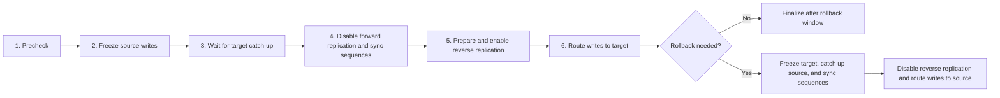

# PostgreSQL cutover tooling

This repository contains a PostgreSQL logical-replication cutover controller
and its rehearsal lab.

- [`cutover-controller/`](cutover-controller/README.md) is the Python CLI for
  a controlled cutover and rollback.
- [`labs/`](labs/README.md) is the environment simulator and operator runbook.
  [`labs/PLAN.md`](labs/PLAN.md) records its topology, failure drills, and
  safety boundaries.

## Cutover flow



Run the controller from its directory:

```bash
cd cutover-controller
uv sync --locked
uv run ./cutover --help
```

## Pre-cutover connection checklist

Run these checks with the exact database names, users, hosts, ports, and TLS
settings planned for migration. Keep passwords in a mode-0600 `.pgpass` or
environment variable; do not put them in commands, YAML, SQL, or shell
history.

### 1. Controller to both databases

From the machine that will run the controller, test DNS/TCP first:

```bash
pg_isready -h "$SOURCE_HOST" -p "$SOURCE_PORT" -d "$DATABASE"
pg_isready -h "$TARGET_HOST" -p "$TARGET_PORT" -d "$DATABASE"
```

Then prove SQL authentication, the selected database, server identity, and
TLS settings:

```bash
PGHOST="$SOURCE_HOST" PGPORT="$SOURCE_PORT" PGUSER="$SOURCE_USER" \
PGDATABASE="$DATABASE" PGSSLMODE="$SOURCE_SSLMODE" \
psql -X -v ON_ERROR_STOP=1 -c \
"SELECT current_database(), current_user, current_setting('server_version'),
        pg_is_in_recovery(), (pg_control_system()).system_identifier;"

PGHOST="$TARGET_HOST" PGPORT="$TARGET_PORT" PGUSER="$TARGET_USER" \
PGDATABASE="$DATABASE" PGSSLMODE="$TARGET_SSLMODE" \
psql -X -v ON_ERROR_STOP=1 -c \
"SELECT current_database(), current_user, current_setting('server_version'),
        pg_is_in_recovery(), (pg_control_system()).system_identifier;"
```

For `verify-ca` or `verify-full`, also set the matching
`PGSSLROOTCERT`. Use `\conninfo` in `psql` to confirm the negotiated
connection. Stop if the database is wrong, either server is a standby, the
identifiers are equal, or certificate verification fails.

### 2. Replication prerequisites

On each publisher, verify:

```sql
SELECT name, setting
FROM pg_settings
WHERE name IN (
  'wal_level',
  'max_replication_slots',
  'max_wal_senders',
  'max_logical_replication_workers',
  'max_sync_workers_per_subscription',
  'max_worker_processes'
)
ORDER BY name;
```

Confirm `wal_level=logical`, reserve capacity for every database, and test
the exact replication-role credentials from the controller machine.

### 3. Both server-to-server directions

Controller connectivity is not enough. Before the production window, use a
disposable database to create and remove an actual publication, subscription,
and slot in both directions:

- target subscriber -> source publisher, matching the forward path;
- source subscriber -> target publisher, matching the rollback path.

For each direction, require all of the following:

- subscription creation completes within the planned timeout;
- the publisher slot exists and becomes active;
- every subscribed relation reaches `ready`;
- a disposable insert reaches the subscriber;
- the subscription can be disabled without leaving an active worker;
- cleanup removes only the named test subscription, slot, and publication.

Use the lab's reviewed helpers and procedure in
[`labs/README.md`](labs/README.md) rather than improvising against
production data. A successful connection from a laptop proves only the
laptop's firewall rule. Cloud allowlists must permit the database server's
actual egress address in each direction.

### 4. Controller gate

After the connection rehearsal and production logical-replication setup, run:

```bash
cd cutover-controller
uv run ./cutover --config ../labs/local/cutover.yaml precheck
```

Proceed only when every configured database reports `READY=YES`, all table
states are ready, lag and error counters are acceptable, capacity has
reserve, and the observed system identifiers match the reviewed
configuration.
